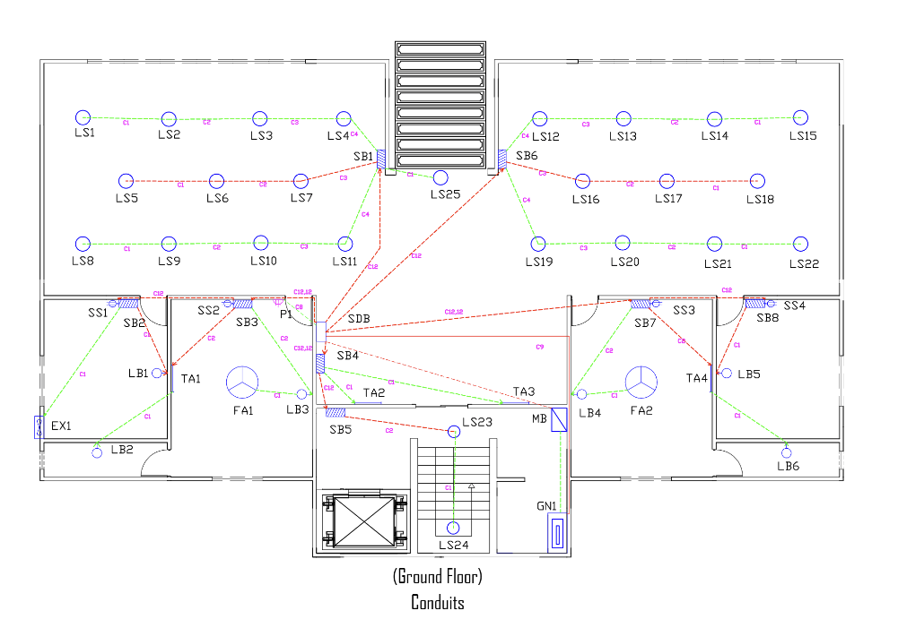
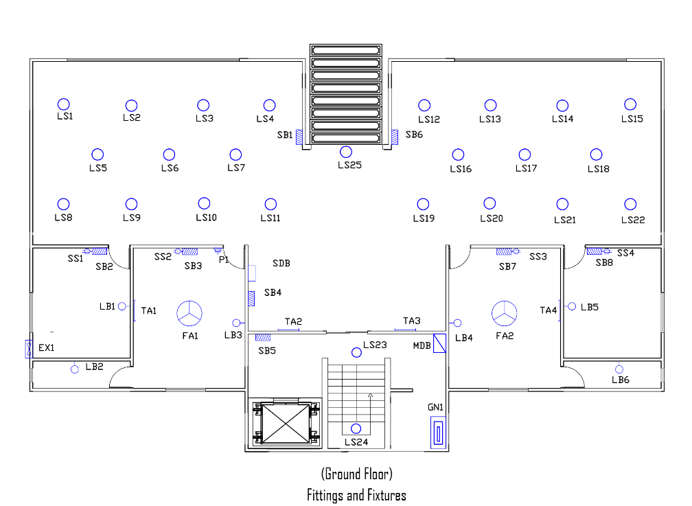

# Electrical Service Design for a Six-Story Residential Building

This repository contains the complete **Electrical Services Design** project developed as part of the **EEE 414 – Electrical Services Design Laboratory** course at the **Bangladesh University of Engineering and Technology (BUET)**.  
The project presents a full electrical design solution for a **multi-storied residential building**, including lighting, power distribution, emergency systems, grounding, and lightning protection.



---

## 📌 Project Overview

The objective of this project is to design a **safe, efficient, and standards-compliant electrical system** for a residential building. The scope of the design includes:

- Lighting layout and illumination calculations  
- Power socket and appliance load analysis  
- Switchboard, Sub-Distribution Board (SDB), Emergency SDB (ESDB), and Main Distribution Board (MDB) design  
- Cable sizing, protection devices (MCB, MCCB), and load calculations  
- Emergency power system with generator integration  
- Lightning protection system design  
- Complete **AutoCAD-based layouts** for fittings and conduits  

All designs follow standard electrical engineering practices and safety considerations.

---

## 🗂️ Repository Structure

```

├── Autocad Files/
│ ├── Ground Floor Layouts
│ ├── 1st–5th Floor Layouts
│ ├── Fittings & Fixtures Drawings
│ ├── Conduit Layouts
│ ├── Switchboard Diagrams
│ ├── SDB, ESDB, MDB Diagrams
│ └── Lightning Protection Layout
│

├── Deliverables/
│ ├── Project Report.pdf
│ └── Final Presentation.pptx
│
├── Final Layout/
│ ├── Floor-wise Electrical Layouts
│ ├── Lighting & Power Fittings
│ ├── Conduit Routing
│ ├── Distribution Board Placement
│ └── Emergency & Backup System Layouts
│
└── README.md


```
---

## 🧩 Final Layout Description

The **Final Layout** folder contains the complete electrical design of the building, including:

### Floor Coverage

- **Ground Floor:** Parking, guard room, driver room, kitchen, store room, bathrooms, staircases, lift area  
- **1st to 5th Floors:** Bedrooms, drawing room, dining room, kitchen, bathrooms, corridors, verandas  

### Detailed Placement of

1. Lighting fixtures (LB, LS, TA, TB, etc.)  
2. Fans and socket outlets  
3. Switchboards  
4. Conduit routing  
5. Emergency lighting points  

Each layout is designed to ensure optimal illumination, operational safety, and ease of maintenance.

---

## Electrical System Components

### ✔ Lighting Design

1. Illumination calculations based on room area and lumen requirements  
2. Efficient fixture selection considering power consumption and cost  

### ✔ Power Distribution

1. Floor-wise **SDB** and **ESDB** design  
2. **MDB** with generator and pump load integration  
3. Proper cable sizing and protection coordination  

### ✔ Emergency System

1. Emergency lighting and socket outlets  
2. Emergency Sub-Distribution Boards (ESDB)  
3. Generator-backed power supply  

### ✔ Lightning Protection System

1. Rooftop air terminals  
2. Down conductors at building corners  
3. Roof and grounding conductors  
4. Designed despite risk index < 40, for enhanced safety  



---

## 📦 Deliverables

All official submission materials are included in the **Deliverables** folder:

- 📘 **Project Report** – Detailed calculations, diagrams, and design explanations  
- 📊 **Presentation Slides** – Summary of system design and results  

---

## 🛠 Tools Used

- **AutoCAD** – Electrical layouts, conduit routing, and system diagrams  
- **Standard Electrical Design Calculations** – Load, current, cable sizing, protection  
- **IEEE and Practical Electrical Standards** – Safety and compliance  

---

## Project Status

✅ **Completed** — Baseline implementation  

🔧 **Open for enhancements and upgrades**

---

## Contributors

- Shafim Bin Hassan (1706172)  
- Subah Karnine (1706174)  
- Farhan Hamid (1706175)  
- Swapneel Sen (1706185)  
- Shahriar Kabir Nahin (1706186)  
- Md. Mehedi Hasan Munna (1706187)  
- Tanisha Tanzina Hasan (1706188)  
- **Joy Saha (1706189)**  

Department of Electrical & Electronic Engineering  
Bangladesh University of Engineering and Technology (BUET)

---

## License

This project is for **academic and educational purposes only**.
